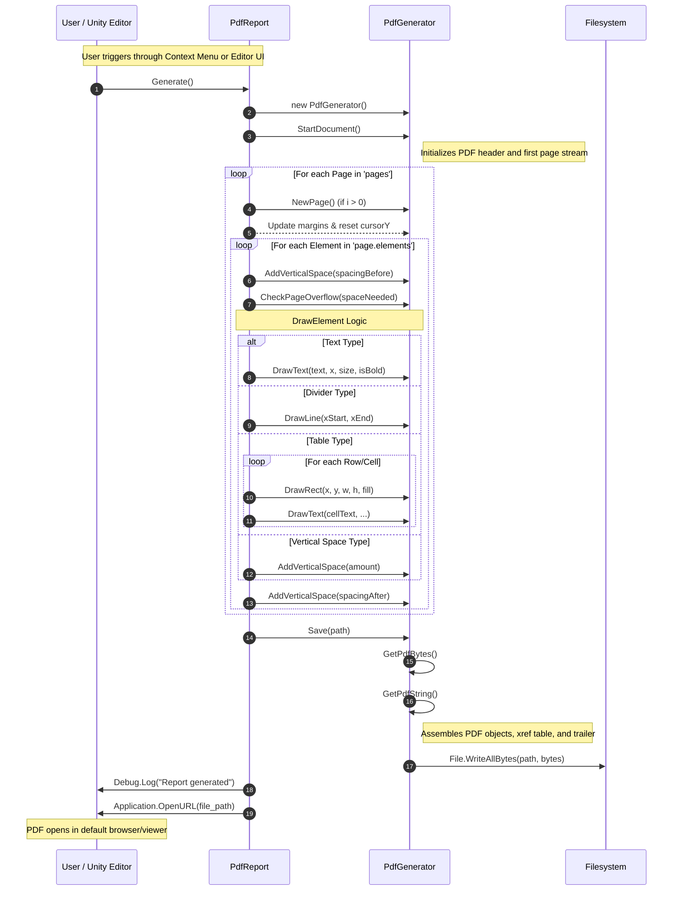

# PdfGenerator Sequence Diagram

This diagram illustrates the flow of generating a PDF report using the `PdfReport` component and the underlying `PdfGenerator` utility.

```mermaid
sequenceDiagram
    autonumber
    participant U as User / Unity Editor
    participant PR as PdfReport
    participant PG as PdfGenerator
    participant F as Filesystem

    Note over U, PR: User triggers through Context Menu or Editor UI
    U->>PR: Generate()
    
    PR->>PG: new PdfGenerator()
    PR->>PG: StartDocument()
    Note right of PG: Initializes PDF header and first page stream
    
    loop For each Page in 'pages'
        PR->>PG: NewPage() (if i > 0)
        PR-->>PG: Update margins & reset cursorY
        
        loop For each Element in 'page.elements'
            PR->>PG: AddVerticalSpace(spacingBefore)
            PR->>PG: CheckPageOverflow(spaceNeeded)
            
            Note over PR, PG: DrawElement Logic
            alt Text Type
                PR->>PG: DrawText(text, x, size, isBold)
            else Divider Type
                PR->>PG: DrawLine(xStart, xEnd)
            else Table Type
                loop For each Row/Cell
                    PR->>PG: DrawRect(x, y, w, h, fill)
                    PR->>PG: DrawText(cellText, ...)
                end
            else Vertical Space Type
                PR->>PG: AddVerticalSpace(amount)
            end
            
            PR->>PG: AddVerticalSpace(spacingAfter)
        end
    end

    PR->>PG: Save(path)
    PG->>PG: GetPdfBytes()
    PG->>PG: GetPdfString()
    Note right of PG: Assembles PDF objects, xref table, and trailer
    PG->>F: File.WriteAllBytes(path, bytes)
    
    PR->>U: Debug.Log("Report generated")
    PR->>U: Application.OpenURL(file_path)
    Note over U: PDF opens in default browser/viewer
```
